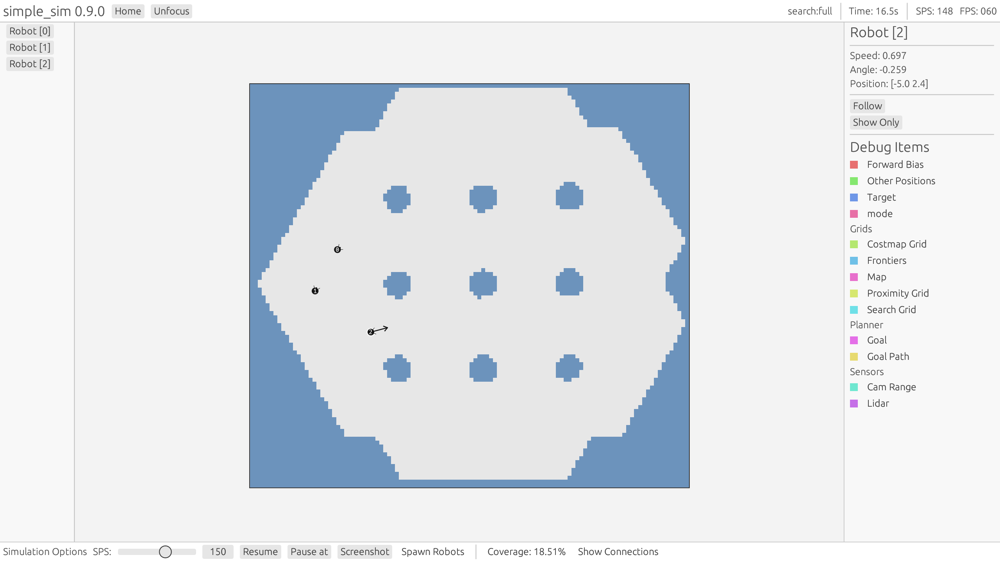
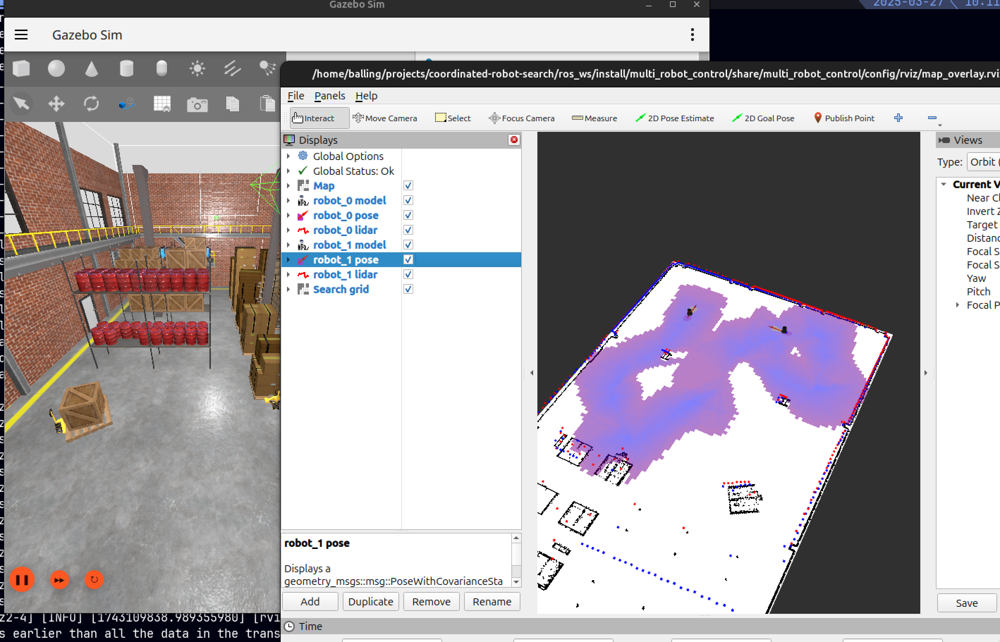

# Coordinated Robot Search

Bachelor Project 2025

- [Thesis Report](https://balderholst.github.io/coordinated-robot-search/report.pdf)
- [botbrain documentation](https://balderholst.github.io/coordinated-robot-search/docs/botbrain/)
- [simple_sim documentation](https://balderholst.github.io/coordinated-robot-search/docs/simple_sim/)

---

## Requirements

Libs, cargo, ROS 2 jazzy, etc.

See [Dockerfile](./Dockerfile) for ready-made dev-setup.

## Botbrain

Library containing the core logic of the project including the search algorithms.

## Simple Sim Integration

Start the simulation with:

```bash
cd simple_sim
cargo run --release -- run ../worlds/bitmap/depot/depot.yaml search:pathing
# For more options:
cargo run --release -- --help
```

Afterwards click `Spawn Robots` and click on the map to spawn robots.
The speed of the simulation can be adjusted by dragging the slider in the bottom left.
Information in the `Debug Soup` can be visualized by clicking on the robot and choosing
a `Debug Item`.



## ROS 2 Integration

A behavior from `botbrain` can be run in a ROS 2 environment.
Example of this is in [multi_robot_control](./ros_ws/src/multi_robot_control)

<!-- TODO: Update to use new syntax -->
The example code can be built with:

```bash
source /opt/ros/jazzy/setup.bash
cd ros_ws
colcon build --symlink-install
source install/setup.bash
```

And run with:

```bash
ros2 launch multi_robot_control multi_robot.launch.py n_robots:=2 behavior:=search:pathing
```

See [ROS 2 Agent](./ros_ws/ros_agent.md) for more information.



## Deep Reinforcement Learning Integration

See [Deep Reinforcement Learning](./trainer/trainer.md)
